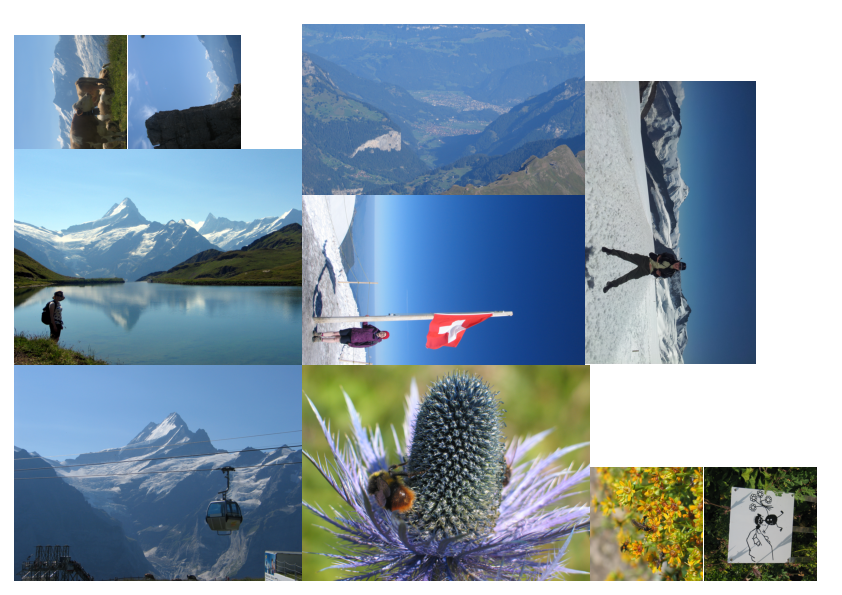

Bulk Photo Print
================

A quick and dirty utility for bulk printing a set of photographs at varying
sizes while trying to minimise the number of sheets of paper required.




Installation
------------

You can install this tool and its dependencies using::

    $ poetry install

The tool is installed as ``bulk-photo-print`` (if you haven't activated the
poetry virtual environment you will need to use ``poetry run
bulk-photo-print`` instead).


Usage
-----

A series of image files may be provided as arguments and will be packed
together and written into an A4 (by default) PDF at ``out.pdf`` (by default)::

    $ bulk-photo-print pic1.jpg pic2.jpg pic3.jpg ...

You can set the dimensions of the printed images using ``--picture-dimensions``
(or ``-d``), for example to produce standard 6" by 4" sized photos:

    $ bulk-photo-print -d 6in 4in pic1.jpg pic2.jpg pic3.jpg ...

Pictures are packed together in such a way that it should be possible to cut
them out using a guillotine.

Scaling and cropping
````````````````````

You can make different pictures different sizes by repeating the
``--picture-dimensions``/``-d`` argument. The dimensions will apply to all
photos after the argument::
    
    $ bulk-photo-print \
        -d 6in 4in large_pictures/*.jpg \
        -d 6cm 4cm small_pictures/*.jpg

By default, photos are rotated, scaled and cropped to best fit within the
specified dimensions. Additional arguments are provided for controlling this
(described below). Like the dimensions, these options can be set differently
for different pictures.

To disable cropping (and instead scale to fit entirely within the specified
dimensions) add the ``--scale`` argument. You can revert to the cropping
behaviour using ``--crop``.

To disable automatic rotation add the ``--no-rotate-for-best-fit`` argument. To
re-enable this behaviour use ``--rotate-for-best-fit``.

By default pictures are centered before cropping in ``--crop`` mode. The
``--alignment`` argument takes two numbers between 0.0 and 1.0 which can
specify alternative X and Y alignments respectively.


Page dimensions
```````````````

To change the page dimensions, the ``--page-dimensions`` argument may be used.
For example, to generate US letter sized output::

    $ bulk-photo-print --page-dimensions 8.5in 11in [...]

By default a 5mm margin is used since many printer's borderless setting has
unpredictable bleed potentially resulting in photos on the edge of the page
being cut off. The ``--margin`` option may be used to change this.

The page size and margin is fixed for all photos and these arguments must
always appear before any image filenames.


Image resampling
````````````````

To prevent the generation of excessively large PDFs, images are resampled to
300 DPI in the output by default. The DPI may be changed using the
``--max-dpi`` argument. Setting the DPI to 0 will disable all resampling
behaviour and always use the original image resolutions.


Limitations
-----------

This software is fairly crude and only really suitable for casual users. For
example, if you were to ask questions containing phrases like 'colour space' or '10
bit colour' this software will look back at you with a blank stare...

The packing algorithm used is fairly basic and can sometimes produce fairly
inefficient layouts. Sometimes this is a result of wishing to retain the
ability to guillotine chop the output, sometimes it is down to pure naivety.

Finally, this tool was built to scratch an itch and probably doesn't have some
of the features you want or care about. Sorry about that!
